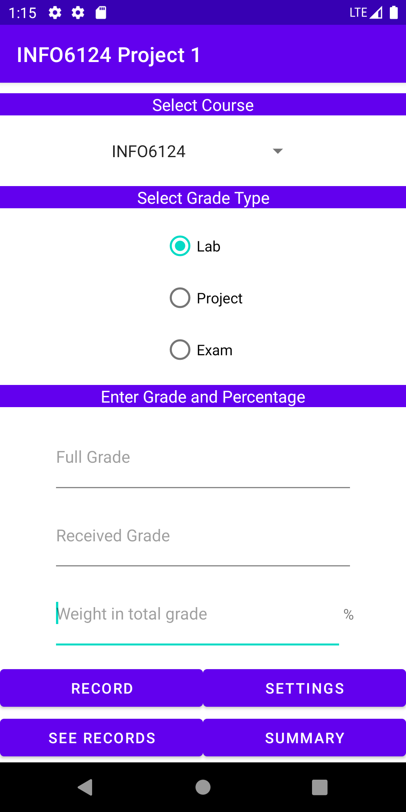
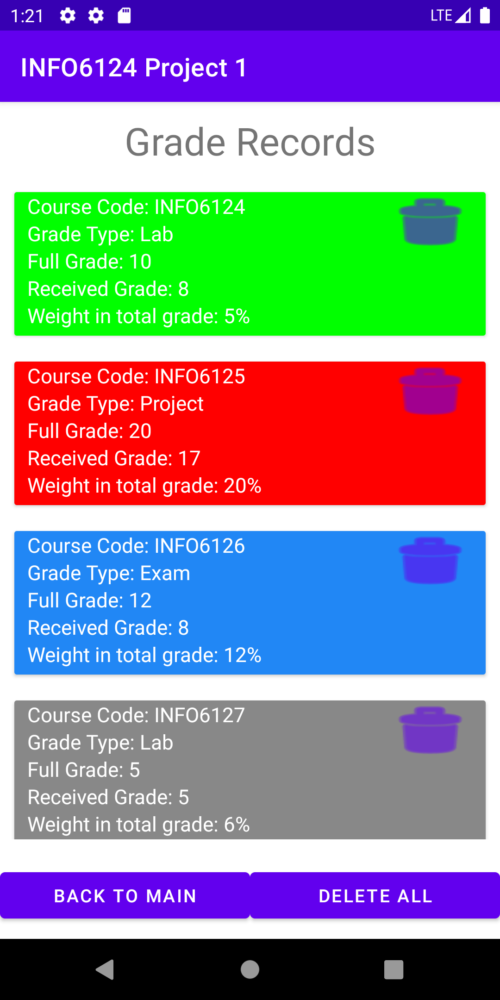
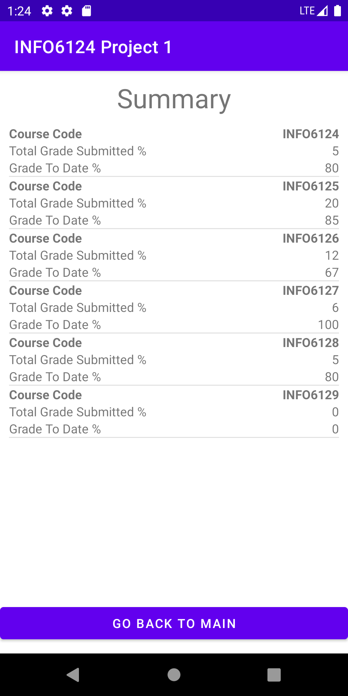

# INFO6124Project1
This is the very first app I developed in my program. It is for students to log their grades as they are progressing in the first semester.

## Tech-Stack
As the very first project of my learning course, it uses some basic techniques to get myself familiar with Android app development.
* Recyclerview & listview
* JSON serialization
* Data persistance (local)
* Basic UI implementation

## Screenshots

  
    
    
</p?
